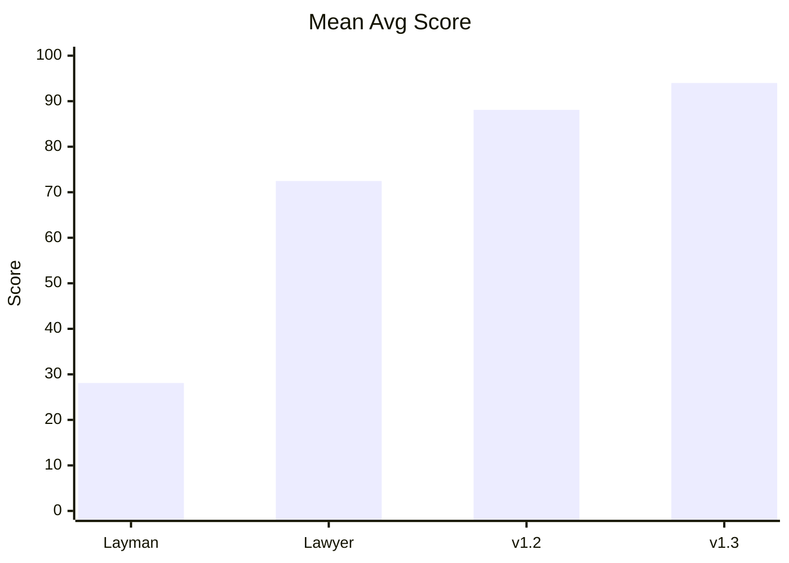
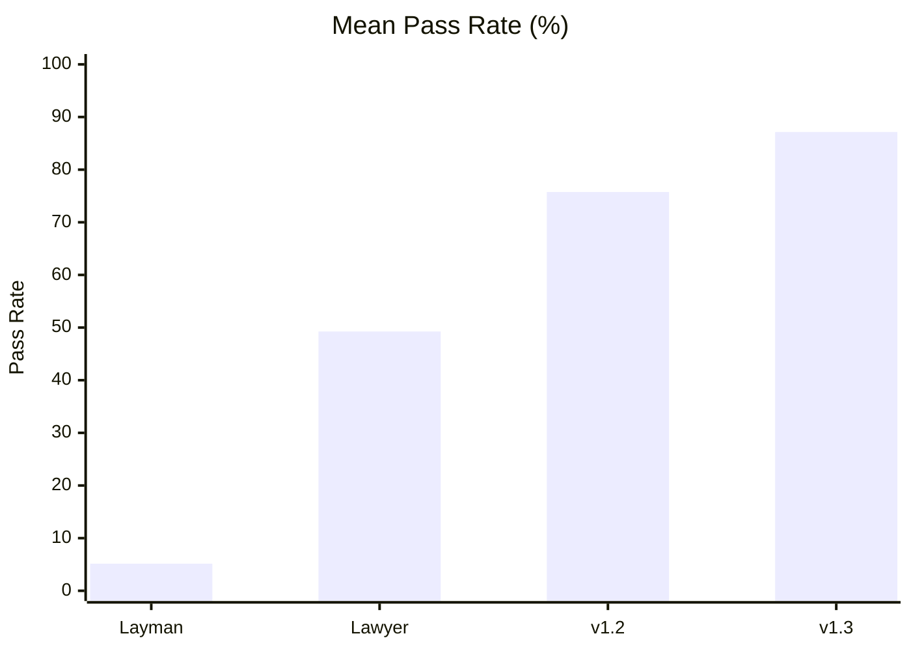

# v1.3 vs v1.2 / Layman / Expert (100-Run Comparison)

> 中文摘要：在 20 个中国大陆合同风险样本、每组 100 次自测下，`v1.3` 的平均分 `93.99`、平均通过率 `87.15%`，显著高于 `v1.2`、普通 prompt 和律师 prompt。  
> English summary: On the 20-case in-repo PRC contract benchmark with 100 runs per group, `v1.3` reaches a mean score of `93.99` and a mean pass rate of `87.15%`, outperforming `v1.2`, a layman prompt, and a lawyer-style prompt.

## Scope

- Dataset size: 20
- Runs per group: 100
- Groups: layman, expert, v1_2, v1_3
- Mode: self-test simulation

## Test Content

- Source set: `benchmark/data/test_cases/*.json`
- Coverage: default liability, silent acceptance, IP ownership, ultra vires guarantee, force majeure abuse, data compliance, jurisdiction, tax, set-off, non-compete, deposit, and other common PRC contract risks
- Core rubric per case:
  - vulnerability recall: whether the key contractual risk was identified
  - mitigation quality: whether the suggested clause was operational and aligned with the case expectation

## Prompt Profiles

- `layman`: generic contract review prompt from a non-lawyer perspective
- `expert`: professional lawyer-style prompt without the v1.3 context-first interview workflow
- `v1_2`: baseline skill
- `v1_3`: context-first skill with Socratic background questions plus Plan B / Plan C output

## Aggregated Results

| Group | Mean Avg Score | Std Avg Score | Mean Pass Rate | Std Pass Rate |
| --- | ---: | ---: | ---: | ---: |
| layman | 28.09 | 6.93 | 5.15% | 4.82% |
| expert | 72.47 | 7.19 | 49.25% | 10.57% |
| v1_2 | 88.09 | 4.72 | 75.75% | 8.81% |
| v1_3 | **93.99** | 3.19 | **87.15%** | 6.41% |

## Delta (v1.3 vs v1.2)

- Mean Avg Score: **5.9**
- Mean Pass Rate: **11.4%**

## Interpretation

v1.3 improves over v1.2 under this benchmark setup, mainly from context-first questioning and dual-option mitigation output.

The largest gain is not in clause spotting alone. The gain comes from forcing the model to ask about business objective, non-negotiable positions, tradeables, and BATNA before rewriting clauses. That raises the pass rate on cases where legal drafting quality depends on transaction context rather than pure clause parsing.

中文补充：
`v1.3` 的优势不只是“更会找条款问题”，而是更会先确认交易背景，再决定修改方向。这类能力恰好对应法务工作里更高价值的部分，因此在需要结合业务底线判断的样本上提升更明显。

## Caveat

This report is a repository-internal benchmark, not an external blind evaluation. The result is useful for relative version comparison inside this project, but it should not be presented as an independent third-party legal accuracy study.

中文提示：
本报告属于仓库内相对比较基准，不应表述为独立第三方测评结论。
